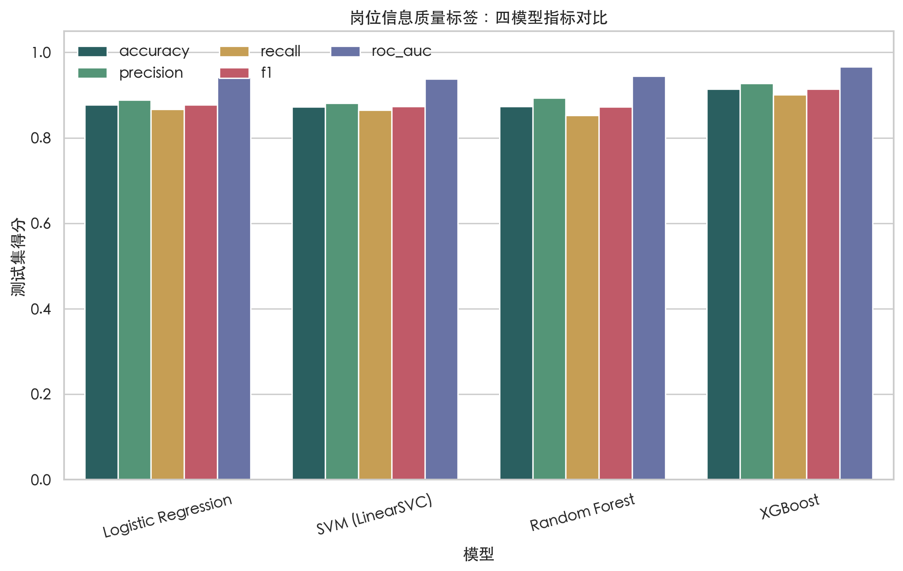
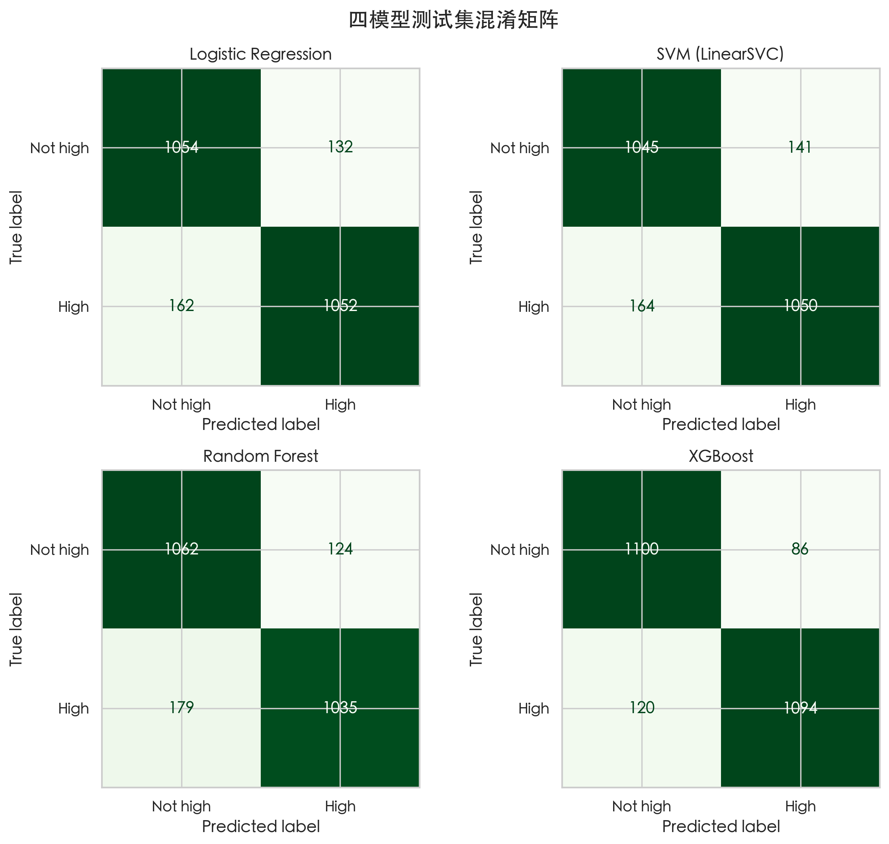
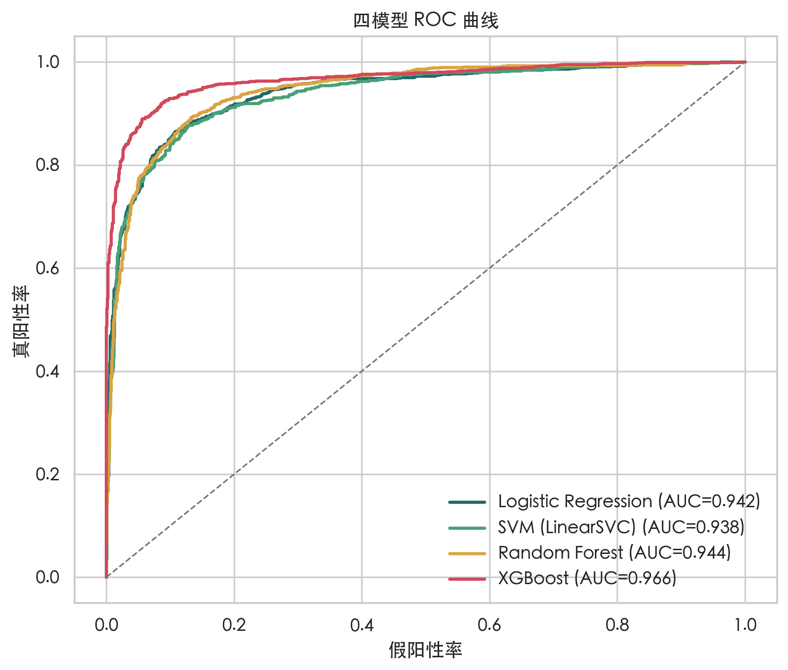

# 岗位质量评分模型

## 1. 业务定义

本项目的“岗位质量”严格定义为岗位信息透明度与完整度，不是雇主信誉、工作体验或候选人录用概率。规则分总计 100 分，涵盖追溯字段、核心字段、地点限制、描述完整性、薪资透明度、技能清晰度、职级、时效性和类别；分数达到 80 定义为高信息质量（`quality_label=1`）。这是课程用代理标签，不是人工真实标签。

## 2. 数据与实验设计

- 去重后样本：12,000 条；高信息质量占 50.6%。
- 固定随机种子 42，按标签分层拆分：训练集 9,600 条，测试集 2,400 条（80/20）。
- 数值特征缺失以训练集内中位数填补并标准化；类别特征以众数填补并独热编码。
- 输入包含岗位文本 TF-IDF、描述长度/结构、技能数、地点限制、发布时间、经验代理和宽类岗位。为避免确定性泄漏，明确排除薪资披露标记、币种、周期、`quality_score`、各规则分项和标签本身。
- 四模型使用同一数据拆分和同一特征预处理，评价 Accuracy、Precision、Recall、F1 与 ROC-AUC。

## 3. 测试集结果

| model | accuracy | precision | recall | f1 | roc_auc |
| --- | ---: | ---: | ---: | ---: | ---: |
| Logistic Regression | 0.8775 | 0.8885 | 0.8666 | 0.8774 | 0.9417 |
| SVM (LinearSVC) | 0.8729 | 0.8816 | 0.8649 | 0.8732 | 0.9381 |
| Random Forest | 0.8738 | 0.8930 | 0.8526 | 0.8723 | 0.9444 |
| XGBoost | 0.9142 | 0.9271 | 0.9012 | 0.9140 | 0.9662 |

按 F1 优先、ROC-AUC 次优的规则，当前表现最好的是 **XGBoost**（F1=0.9140，ROC-AUC=0.9662）。

## 4. 可解释性

Random Forest 的主要特征为：`description_word_count` (0.026)、`description_length` (0.021)、`text__range` (0.020)、`text__and` (0.016)、`text__000` (0.016)、`text__for this` (0.015)、`text__compensation` (0.014)、`text__salary` (0.013)。特征重要性表示模型在复现规则标签时使用这些变量的相对程度，不代表因果影响。树模型完整 Top 20 图和 CSV 均保存在 `reports/modeling/`。

## 5. 局限与答辩口径

指标高并不意味着模型已经识别真实好岗位，因为标签由同一份岗位信息中的固定规则生成，模型评价的是规则可学习性。当前最重要的外部效度缺口是没有候选人反馈、录用结果、企业信誉和人工双人标注。答辩时应称其为“岗位信息质量评分模型”；下一阶段可抽样 300 至 500 条由两名标注者独立评价，报告一致性，并用人工标签重新训练和校准阈值。
